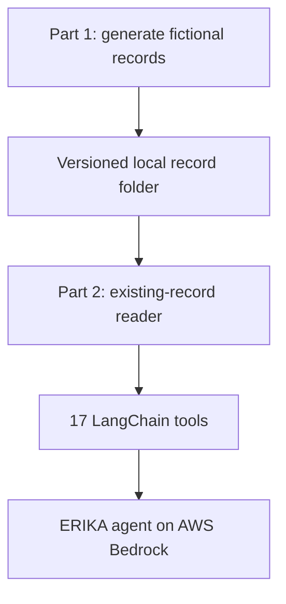

# ERIKA — Healthcare Records Assistant (Synthetic Demo)

**A file-backed LangChain agent that answers questions over an existing fictional hospital dataset using Amazon Bedrock.** The project separates data generation from the agent: you can start the agent in a fresh notebook session and point it at records already on disk.

> **Portfolio project:** This is an educational prototype using fictional patients. It is not a clinical decision support product or a deployment for real patient data.

## What this demonstrates

- **Agent design:** 17 LangChain tools for patient and visit lookup, document search and reading, appointments, BMI, billing, educational explanations, and fictional case discussion.
- **Existing-data workflow:** the agent loads a versioned folder and checks that its patient files and referenced notes exist. It does not regenerate the records.
- **File-backed retrieval:** document IDs link to complete local note files; the agent can inspect each patient's records and search the documents.
- **Safety-aware teaching examples:** an urgent-pattern fixture suppresses ordinary diagnostic suggestions, while case discussions distinguish documented facts from hypotheses and missing information.
- **Offline verification:** a standard-library smoke test generates a fixture in a temporary folder and checks that an independent reader can open every note. CI runs without AWS credentials.

### Architecture



The 20 fictional patients, 47 visits, notes, appointments, and teaching cases are generated locally. Generated records are ignored by Git. The repository contains the generator, the reader and agent notebook, and offline tests.

## Repository contents

| Path | Purpose |
| --- | --- |
| [`notebooks/ERIKA_Part_1_Generate_Data.ipynb`](notebooks/ERIKA_Part_1_Generate_Data.ipynb) | Creates and validates fictional records and teaching cases. No AWS call. |
| [`notebooks/ERIKA_Part_2_Agent_Existing_Records.ipynb`](notebooks/ERIKA_Part_2_Agent_Existing_Records.ipynb) | Opens an existing folder, configures Bedrock, builds the agent, and runs example questions. |
| [`tests/test_notebooks.py`](tests/test_notebooks.py) | Offline data handoff, schema, note ownership, and missing-folder checks. |
| [`.env.example`](.env.example) | Placeholder for local Bedrock authentication. |
| [`docs/PORTFOLIO_COPY.md`](docs/PORTFOLIO_COPY.md) | GitHub description, topics, demo script, and portfolio copy. |

## Requirements

- Python **3.12 or 3.13** recommended (the offline CI checks both). The notebook uses Python syntax available in 3.10+.
- Jupyter Notebook and the packages in `requirements.txt`.
- For Part 2 model calls: an AWS account with access to Amazon Bedrock, an active Bedrock API key, internet access, and permission to invoke the configured model. The current notebook uses region `ap-southeast-2` and model ID `global.amazon.nova-2-lite-v1:0`; change these in its configuration cell for your account.
- Part 1 and the offline tests do **not** need AWS credentials.

### Install (Windows PowerShell)

```powershell
git clone https://github.com/YOUR_USERNAME/erika-healthcare-agent.git
cd erika-healthcare-agent
py -3.12 -m venv .venv
.venv\Scripts\Activate.ps1
python -m pip install --upgrade pip
python -m pip install -r requirements.txt
python -m notebook
```

### Install (macOS or Linux)

```bash
git clone https://github.com/YOUR_USERNAME/erika-healthcare-agent.git
cd erika-healthcare-agent
python3 -m venv .venv
source .venv/bin/activate
python -m pip install --upgrade pip
python -m pip install -r requirements.txt
python -m notebook
```

Replace `YOUR_USERNAME` after publishing. To use a downloaded ZIP instead, extract it, open a terminal in the `erika-healthcare-agent` folder, and begin with the virtual-environment command. The first code cell in Part 2 also installs its runtime libraries; after installing `requirements.txt`, you may skip that cell.

## Run the notebooks

1. In Jupyter, open **Part 1** and choose **Restart Kernel and Run All Cells**. It creates `hospital_open_synthetic_data/` in Jupyter's current working directory and prints the output path. The last cell writes `fictional_training_cases.json` inside that folder.
2. Copy `.env.example` to `.env` in the repository root and replace the placeholder with your own `AWS_BEARER_TOKEN_BEDROCK` value. Never share the key or commit `.env`. Alternatively, set the environment variable in your shell before starting Jupyter. Bedrock API keys are described in [AWS's documentation](https://docs.aws.amazon.com/bedrock/latest/userguide/api-keys.html).
3. Open **Part 2**. Its `DATA_DIR` cell defaults to `Path.cwd() / "hospital_open_synthetic_data"`. If Jupyter's working directory differs or the records are elsewhere, set `DATA_DIR` to the **absolute path of the existing folder**.
4. Run Part 2 from the top. It verifies the folder, opens the 20 patient files and notes, loads teaching cases, builds `erika_agent`, and offers example questions. Model calls use Bedrock and may incur charges.

**If the data already exists:** skip Part 1. Point Part 2's `DATA_DIR` to the folder and run Part 2. The current reader requires this project's `manifest.json` version 4 layout; arbitrary EHR exports, CSVs, or loose PDFs need an ingestion adapter first. See [data contract](docs/DATA_CONTRACT.md).

### A quick agent question

After the Part 2 setup cells run, try:

```python
result = erika_agent.invoke({
    "messages": [{
        "role": "user",
        "content": "How many fictional patients and hospital visits are recorded?"
    }]
})
print(result["messages"][-1].content)
```

The offline fixture check expects **20 patients and 47 visits**. Exact model wording varies. The current system prompt limits responses to 450 characters, which may be too short for complex cases.

## Test without AWS

From the repository root:

```bash
python -m unittest discover -s tests -v
```

The test creates data in a temporary directory, opens it with the independent agent-side reader, checks all 47 seeded notes and sample calculations, and verifies that a missing folder is rejected without being created. GitHub Actions runs this check on push and pull request. This does not test model quality or live Bedrock access.

## Troubleshooting

| Symptom | Check |
| --- | --- |
| `FileNotFoundError` for `manifest.json` or cases | Run all of Part 1 or set Part 2's `DATA_DIR` to the existing output folder, not its parent. |
| Bedrock authentication error | Check the key in `.env`, its validity, and that Jupyter started in the repository root; restart the kernel after changing environment variables. |
| Model access or region error | Check `AWS_REGION`, `MODEL_ID`, and access for that model in your AWS account. |
| `erika_agent` is defined in notebook | Use the Part 2 notebook in this repository; its examples call `erika_agent`. |
| Different records cannot be read | Follow the [data contract](docs/DATA_CONTRACT.md) or build an ingestion adapter. The reader does not infer arbitrary schemas. |

## Boundaries and next steps

The tool currently offers **no patient-level access control**, uses a limited educational reference fixture, and includes a synthetic payment tool that writes to local data only when explicitly invoked. Clinical suggestions are not validated for patient care. Do not upload real patient records, identifiers, credentials, or generated local data to this repository. Before a real clinical integration, add identity and consent, patient-scoped authorization, audit logs, document ingestion and source provenance, clinical evaluation, and a reviewed safety workflow.

Potential engineering extensions: a schema adapter for external records; retrieval evaluation with cited document spans; patient isolation; stronger response-length validation; and a mock model test of tool selection. These are roadmap items, not implemented features.

## Ask questions about the existing records

```bash
These examples call the model independently. Run any one after Section 6. They read records from `DATA_DIR`.
```

### 1 Record and visit lookup

These examples call the model independently. Run any one after Section 6. They read records from `DATA_DIR`.


```bash
How many fictional patients and hospital visits are recorded?
```


```bash
For SYN-007, show admission date, discharge status and relevant note ID
```


### 2 General health questions and documented explanations

```bash
I have cold, what is the diagnosis. Also  nasal congestion
```


```bash
I need educational info for cold
```


```bash
provide educational material on upper‑respiratory‑infection management
```


```bash
Explain the documented diagnosis at SYN-001 encounter ENC-001-1 with a source link.
```


```bash
what is hypertension
```


```bash
can you perform calculations?
```


```bash
what is the BMI of a patient with 56kg and 178 cm. the age of the patient is 30 year. is this a good BMI or is that a medical issue? What are the possible prognosis
```


### 3 Patient list, billing, and general information
The balance example reflects payments already stored in the folder.

```bash
List all patients id
```


```bash
What is SYN-001's verified balance after the additional test payment of $100?
```


```bash
what is cancer
```


### 4 Fictional pasted cases

```bash
Fictional case: A 45-year-old has four weeks of dizziness on standing,
episodic palpitations, and loose stools. A new medication was started
two weeks ago. No vital signs or test results are available.

Explain possible causes as hypotheses, what information is missing,
and what should be discussed with a clinician. This case is not in
any patient document.
```


```bash
Fictional discharge-note text: HFrEF with an ejection fraction of
35%; CKD stage G3b with eGFR 38 mL/min/1.73 m²; type 2 diabetes in the
history. Repeat blood tests and cardiology follow-up were requested. Iron
studies are pending. An older list says furosemide 20 mg daily, while the
discharge list says 40 mg daily. The current dose is unknown. No new
symptoms are reported.

Explain the terms and measurements in plain language. Separate what this
pasted text states from general information and what remains unknown.
Explain why the heart and kidney conditions may both matter. Identify the
medication-list discrepancy.
```


## License

MIT; see [`LICENSE`](LICENSE).
